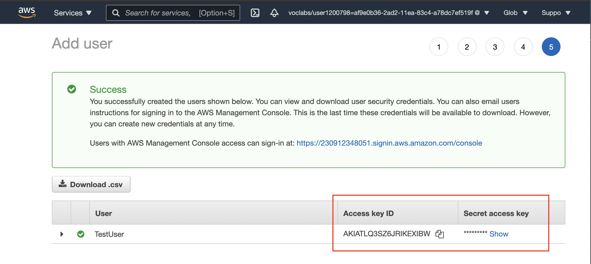
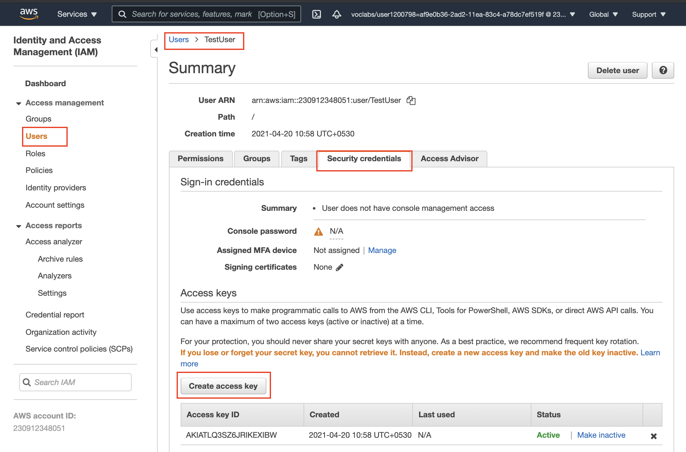

# Schema on Read: _Big Data_ ELT on Music Listening Application data.

### Prerequisite Steps in AWS:

#### 1. Create a new IAM user
IAM service is a global service, meaning newly created IAM users are not restricted to a specific region by default.
- Go to [AWS IAM service](https://console.aws.amazon.com/iam/home#/users) and click on the "**Add user**" button to create a new IAM user in your AWS account. 
- Choose a name of your choice. 
- Select "*Programmatic access*" as the access type. Click Next. 
- Choose the *Attach existing policies directly* tab, and select the "**AdministratorAccess**". Click Next. 
- Skip adding any tags. Click Next. 
- Review and create the user. It will show you a pair of access key ID and secret.
- Take note of the pair of access key ID and secret. This pair is collectively known as **Access key**. 

<center>
<br><br>
Snapshot of a pair of an Access key
</center>

##### <font color='red'>2. Save the access key and secret</font>
Edit the file `dwh.cfg` in the same folder as this notebook and save the access key and secret against the following variables:
```bash
KEY= <YOUR_AWS_KEY>
SECRET= <YOUR_AWS_SECRET>
```
    
For example:
```bash
KEY=6JW3ATLQ34PH3AKI
SECRET=wnoBHA+qUBFgwCRHJqgqrLU0i
```

<center>
<br><br>
Snapshot of creating a new Access keys for the existing user
</center>

#### 2. Save Access key and put credentials into Configuration (`*.cfg`) file along with the intended Redshift database specifications. 
In this demo, the configuation file looks like:
```
[AWS]
KEY= ********************
SECRET= ****************************************
```

#### 3. Create a new EC2 Key Pair to allow for EMR to connect to and deploy within your VPC.
- Use a `<key-name>.ppk` file for Windows and `<key-name>.pem` for UNIX-based operating systems like Mac and Linux.
- When running scripts like `Deploy-EMR.py` make sure to either run the script in the same directory as the key-pair downloaded file, or in the script specify the full path to the key pair file.

# ELT Proccess: 
### Create EMR cluster 
In this project `Deploy-EMR.py` is used to create and deploy an EMR cluster.

### Submit a Spark Job to the Cluster for ELT
- `elt.py` will run a Spark job that will create a spark session in EMR and then Extract dataset from S3, Load the data into the Spark session, and Transform the data from S3 into a star-schema based design. Then finally, offload the Star-Schema tables into Parquet files in S3.
    - Each of the five tables are written to parquet files in a separate analytics directory on S3. 
    - Each table has its own folder within the directory. 
        - Songs table files are partitioned by year and then artist. 
        - Time table files are partitioned by year and month. 
        - Songplays table files are partitioned by year and month.
        - Users and Artists tables are not partinoned since they are smaller tables. (If the size of this simulated dataset was larger both could be partioned alphabetically or by year,month of creation.)


##### <font color='red'>If creating your own spark job using pyspark, make sure to close the session in the script or use an EMR cluster that uses auto-termination to avoid unwanted AWS costs.</font>

### Data Sources
- This project creates and executes an ETL pipeline for a mock music streaming application. This was made during an assignment from the [Udacity Data Engineering Nanodegree](https://www.udacity.com/course/data-engineer-nanodegree--nd027).
- Both the Song Data and Log Data are stored in an S3 bucket maintained by Udacity.

#### Song Data
Song data is composed of many JSON files each contiaing infromation on the artist who created the song and the song's details.
```
{num_songs:1
artist_id:"ARKRRTF1187B9984DA"
artist_latitude:null
artist_longitude:null
artist_location:""
artist_name:"Sonora Santanera"
song_id:"SOXVLOJ12AB0189215"
title:"Amor De Cabaret"
duration:177.47546
year:0}
```
#### Log Data
Log data is series of log files from the music listening appplication that details various statictics and facts about a user's activity on the platform. Shown blow, is an exmaple of one entry in the log file. (PII has been redacted, and in place is XXX to show where in an actual log that information would go.)
```
{'artist': "Des'ree",
 'auth': 'Logged In',
 'firstName': 'XXX',
 'gender': 'XXX',
 'itemInSession': 1,
 'lastName': 'XXX',
 'length': 246.30812,
 'level': 'free',
 'location': 'Phoenix-Mesa-Scottsdale, AZ',
 'method': 'PUT',
 'page': 'NextSong',
 'registration': 1540344794796.0,
 'sessionId': 139,
 'song': 'You Gotta Be',
 'status': 200,
 'ts': 1541106106796,
 'userAgent': '"Mozilla\\/5.0 (Windows NT 6.1; WOW64) AppleWebKit\\/537.36 (KHTML, like Gecko) Chrome\\/35.0.1916.153 Safari\\/537.36"',
 'userId': '8'}
```

## Analysis File Output
The data in this "database" is organized into a star schema consisiting of the 1 fact table detailing songs listened to and by who in addition to 4 different dimension tables that add context to the user activity data generated from log files. After proccesing in Spark, the organized data is stored as hierarchal parquet files each in a separate analytics directory on S3.


 
